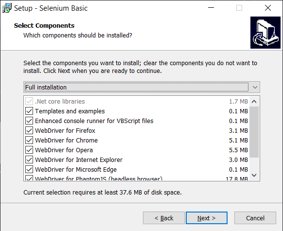
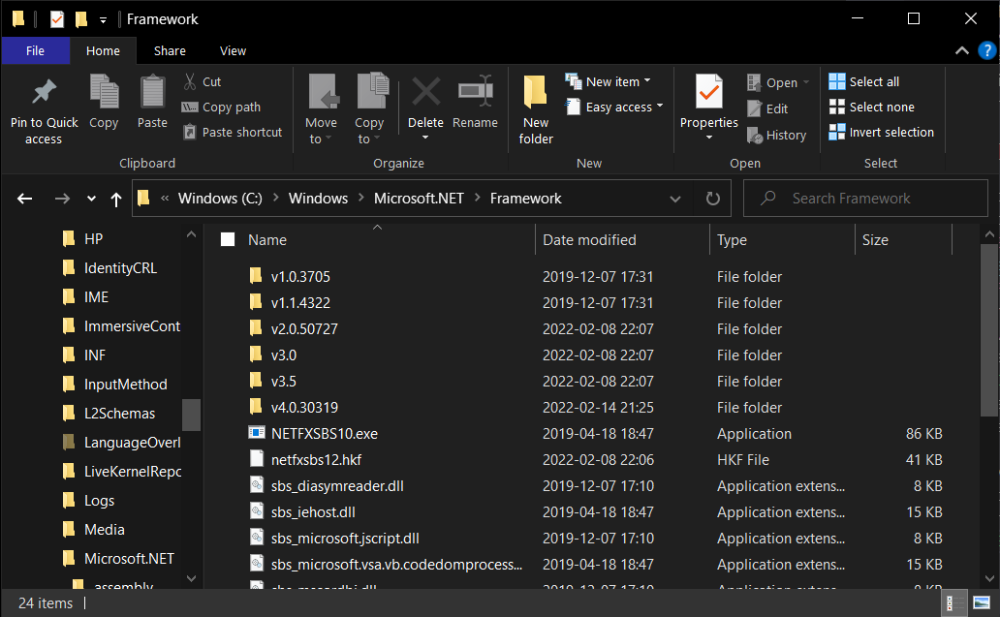
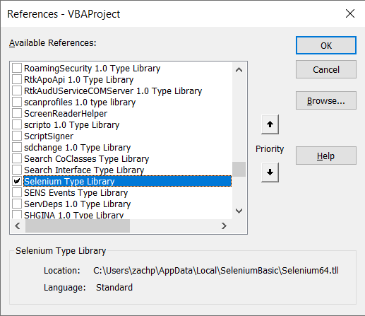

The library most commonly recommended for web automation is Selenium, which supports driving a variety of browsers and officially provides bindings for a number of languages. Unfortunately it doesn't officially support the ultimate programming language, Visual Basic. For VB, this is a single blemish on the otherwise immaculate language, and for Selenium, it's a unforgivable crime.

Luckily there is a glimmer of hope. SeleniumBasic is a Selenium based framework for the VB family. Now you may look at it and think "this is unmaintained and hasn't been updated since 2016", but it was actually perfected in 2016 and no update could ever possibly improve it.

So it is only natural that these two exquisite pieces of software (that are in no way whatsoever out of date) work together. Unfortunately there's a few...underdocumented hiccups that arise from integrating these two. This post is written in the hopes of making the hiccups between VBA (in Excel) and SeleniumBasic slightly more documented.

## Installation

 - Excel (duh)
 - [SeleniumBasic](https://github.com/florentbr/SeleniumBasic/releases)
 - A WebDriver
 - [.NET Framework 3.5](https://www.microsoft.com/en-au/download/details.aspx?id=21)
 
Given that the VBA interface in Excel hasn't been updated since...1832...I am going to assume Excel version will not have any major impacts, but for reference I used Version 2201.

Each of the major web browsers provides a WebDriver, which is a piece of software that allows a browser to be controlled and automated by external programs. The SeleniumBasic installer includes a number of WebDrivers which you can choose to include, but these all appear to be wildly out of date and will cause Excel to crash if you have a recent browser installed.



To fix this you will need to manually replace the WebDrivers you intend to use. Each of the major browser vendors distribute up to date versions of their own WebDrivers ([Edge](https://developer.microsoft.com/en-us/microsoft-edge/tools/webdriver/), [Chrome](https://chromedriver.chromium.org/downloads), [Firefox](https://github.com/mozilla/geckodriver/releases)). Within each of these zip archive you'll find an executable, e.g. `msedgedriver.exe` for everyone's fifth favourite browser. To replace driver included with SeleniumBasic, you need to place the up to date executable in `C:\Users\<username>\AppData\Local\SeleniumBasic`. The up to date WebDriver will need to have the same name as the original outdated WebDriver, so `msedgedriver.exe` needs to be renamed `edgedriver.exe`. Irritatingly, it's probable that eventually automatic browser updates will render even these updated WebDrivers outdated, and these executables will need to be replaced again.

.NET Framework versions annoyingly don't show up as installed programs, so if you want to find out what versions you already have installed, you must use one of several annoying ways. The least annoying of these is to look in the `C:\Windows\Microsoft.NET\Framework` directory.



## Actual Use

Now you can actually use it as you'd expect.  Open the VBA IDE in Excel start using some of the gorgeous syntax and best in-class tools that Microsoft so kindly allows you to purchase.

To enable SeleniumBasic in Excel you'll need to navigate to `Tools > References` and check `Selenium Type Library`.



From here you can write fairly standard Selenium code in VBA.

```VB
Sub AutoSearch()

Dim driver As Selenium.EdgeDriver
Set driver = New Selenium.EdgeDriver

driver.Start
driver.Get ("https://old.reddit.com/")

Dim searchbox As WebElement
Set searchbox = driver.FindElementByName("q", -1, True)
searchbox.SendKeys ("selenium")

Dim submit As WebElement
Set submit = driver.FindElementById("search", -1, True)
submit.submit

driver.Quit

End Sub
```

## Footnotes

1. Software versions used: Windows 10 10.0.19043, Excel 2201, SeleniumBasic 2.0.9.0, Edge 98.0.1108.50, EdgeDriver 98.0.1108.51
2. [Official Selenium Documentation](https://www.selenium.dev/documentation/overview/)
3. A fantastic resource for VBA+Selenium is [WiseOwlTutorials' series](https://youtube.com/playlist?list=PLNIs-AWhQzcl3xKvF8sVL4sWRWICj_clM) on this exact thing.
