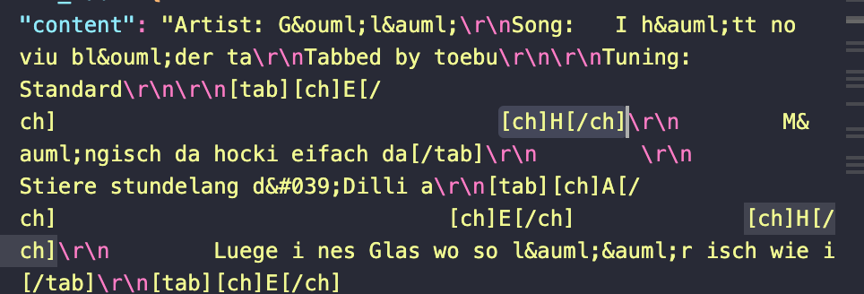
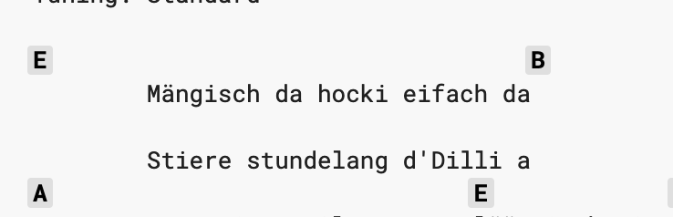
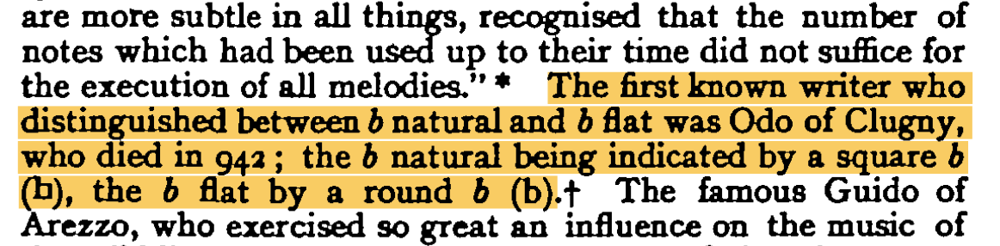
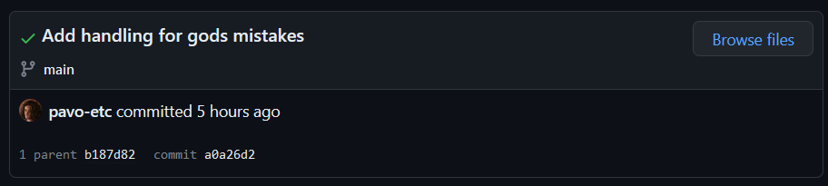

I received a [strange bug report](https://github.com/pavo-etc/penultimate-guitar/issues/41) on [Penultimate Guitar](https://pg.zachmanson.com) where the Next.js rendering would fail completely on certain songs.

## The Error

The type error was being triggered by a chord component, where the key was undefined. The chords are pulled from Ultimate Guitar, so I inspected the JSON payload from the [original source](https://tabs.ultimate-guitar.com/tab/1684995).

Why the hell is there a `[ch]H[/ch]` chord in there? That's definitely the cause as I never accounted for non-existent keys. Looking at Ultimate Guitar, it renders as a B chord.

Huh?

An aside on Ultimate Guitar HTML

The way Ultimate Guitar handles data is bizarre. It passes a static dehydrated HTML page to the client.  The data payload is in the HTML as well, but instead of being contained in a `script` tag it's a giant JSON payload in an escaped string within an attribute of a random `div`

## One Google Search Later

Germany and the Netherlands ha(d/ve) their own musical key notation that include(d/s) a H chord. [This site](https://www.guitarsite.com/newsletters/010122/12.shtml) claims it ended in "1994/1995", though I've seen [other](https://github.com/pavo-etc/penultimate-guitar/issues/41#issuecomment-1538452351) [sources](https://www.reddit.com/r/musictheory/comments/8rn0ve) claim its still taught this way. This comes as an artifact of the bizarre history Western music notation, which is a problem I seem to keep running into recently in my attempts to learn more about music theory.

> I learned in music school that the chord is called "B" (like in the rest of the world), but the note is called "H" (eg. the C Major scale would be C, D, E, F, G, A, H, C).

<cite>TobTobXX, who reported the bug</cite>

## Western Music's Stupid Origins

Western music is based on ecclesiastic modes used in church in the early Middle Ages, which only used the diatonic notes of the C scale (_natural_ notes). The musical notation systems of the time reflected this, not accounting for notes outside of the C scale. When sharps and flats later came into more common use, the existing notation systems needed a way to distinguish them from the natural notes they sat between.

This problem first arose with B natural and B flat, according to the [Encyclopedia Britannica](https://www.britannica.com/art/musical-expression). The first method of distinguishing B from B flat was using two different forms of the lowercase "b" character:

Niecks, Frederick. “The Flat, Sharp, and Natural. A Historical Sketch.” _Proceedings of the Musical Association_, vol. 16, 1889, pp. 79–100.

Somewhere along the line in Germany, monks transcribing these square and round "b" characters confused the squared "b" for "h", and this was later assumed to be intentional. "H" became a convention for writing B natural, while the "b" character remained convention for writing B flat. "B" and "b" became amalgamated, both coming to represent modern B flat.

In the rest of the world, this "H" note didn't catch on.

In time, notation for sharp and flat notes other than B flat was needed. This use of square and round "b" to denote B and B flat eventually evolved into our modern notation for indicating natural and non-natural, _accidentals_. ♭ comes from the round "b", while ♯ and ♮ come from the square "b".

Somehow, Germany still hasn't fully corrected this mistake, continuing to use "H" to represent B natural and many places. Including Ultimate Guitar. Ugh.

## Resolution

I don't love dealing with problems caused by the whims of millenia dead monks, but this was an interesting rabbit hole to fall into. The issue has since been patched, and I look forward to my mistakes ruining someone's day in 3023.

 An aside on The Flat, Sharp, and Natural. A Historical Sketch 

When I first copied the text from the article, it copied that "square b" as a "h". Funny that modern OCR technology makes the same mistakes at 1000 year old monks.

> The first known writer who distinguished between b natural and b flat was Odo of Clugny, who died in 942 ; the b natural being indicated by a square b (h), the b flat by a round b (b)

It was also a pain in the ass to find a copy of that article. It's mostly found on paywalled academic sites despite the article definitely being out of copyright. Luckily the Internet Archive [has a copy](https://scholar.archive.org/work/3jdud373effq3e376gqtlkxqvq).

